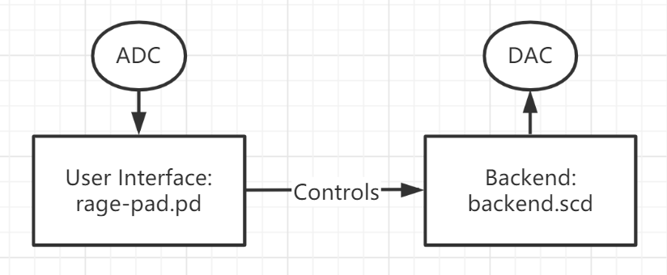
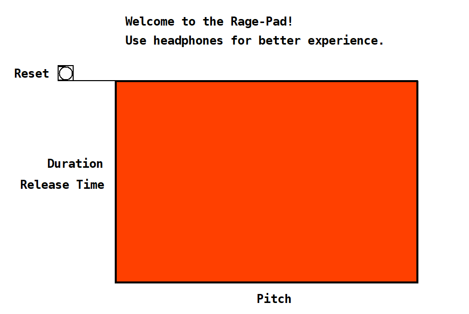

TEST ENVIRONMENT:

- Windows 10
- SuperCollider 3.11.2
- Pd version 0.51.3

# Rage Pad

*You can never play a same melody.*

*It is not a serious project but a demonstration of what I learned in [DT2213](https://www.kth.se/student/kurser/kurs/DT2213?l=en) at KTH.*

## Design

Rage pad can be seen as a normal instrument just as other common ones, except that the mapping from the user input to the sounds fluctuates with the microphone input, which introduces **randomicity**. It will be annoying if you aim to perform a song, while you can also have a lot of fun.

There is no special timbre for the sound generation but three sound effects (slide, tremolo, and vibrato), which can be triggered with the control inputs. Besides, the sound effects, the basic two properties can be controlled on the user side are the frequency and duration (or, release time if the sound is sustained).

## Implementation

### User Interface

The user interface was developed in Pure Data, responsible for input detection and OSC control transmission. Mouse position will be retrieved when there is a click inside the pad, which also triggers a transition of the background color. Afterwards, a number randomized in `[0, loudness]` is added to the position. In addition to the mouse position, the "keydown "message (an array of key states: `[up/down, key code]`) will be also sent to SuperCollider via OSC. A third message `reset` is used to recover from an abnormal situation. That is, we have three types of messages:

- mouse position `(x, y)` in `/mouse` channel
- keyboard states in `/keyboard` channel
- reset signal in `/reset` channel

### Synthesizer Backend

A sound generated (map `x` to frequency) can be sustaining (map `y` to release time) or played within a given duration (map `y` to duration). A sustaining one is multiplied by an attack-sustain-release envelope, while a fixed-length one is controlled by a triangle envelope.

There are totally four types of sounds:

- The basic one, is generated by a sine oscillator.
- A slide sound, is generated by a sine oscillator, where the frequency is modulated linearly from a frequency to the other one.
- A tremolo sound, is generated by a sine oscillator, where the multiplier of the value, i.e., the amplitude, is modulated by a low-frequency sine wave (4 Hz).
- A vibrato sound, is generated by a sine oscillator, where the frequency is modulated by a low-frequency sine wave (5 Hz).

All synths are trigged in the callbacks of OSC receiving functions.

## Things can be improved

- Audio data should be sent through OSC and played in the User Interface, so that SuperCollider server can be remote.
- Sustaining sounds should be released with the mouse released, but there is no detection of releasing the mouse in Pure Data.
- Uses should be able to change the volumes, but I have no idea how I can avoid blowing speakers.
- The release action should be possibly applied to a specific sound.
- Codes should be cleaned: `if` to `switch` or `case`.
- No idea why some released Synths with `doneAction: freeSelf` are not removed from the Node Tree successfully.
- It is a bit tricky to avoid conflict between build-in shortcuts and the control keys.
- The change of the background color of Rage Pad can be smoother.

## References

- [xy: Abstraction to get mouse click and drag coordinates (vanilla)](https://forum.pdpatchrepo.info/topic/10854/xy-abstraction-to-get-mouse-click-and-drag-coordinates-vanilla)

## Information in `demo.pd`

### Requirements

- SuperCollider: Run `backend.scd`
- PureData: Make sure the following files exist in the current directory.
  1. `rage-pad.pd`
  2. `xy.pd`

---

### Instruction

- Try to click on the pad to play a simple sound.
- Press and hold <kbd>S</kbd>, and click to perform a slide effect.
- Press and hold <kbd>R</kbd>, and click to perform a vibrato effect.
- Press and hold <kbd>T</kbd>, and click to perform a tremolo effect.
- Press and hold <kbd>Space</kbd>, and click to sustain the sound.
- Press and hold <kbd>A</kbd>, and click to add a new sound with the performing effect or sustain it, otherwise, new clicks will trigger a normal sound.
- Go ahead and play!

---

### Tips

- <kbd>S</kbd> (slide), <kbd>R</kbd> (vibrato) and <kbd>T</kbd> (tremolo) work exclusively.
- Keep quiet to lower the randomicity.
- Turn up the volume of your device if it is not loud enough.
- If there is anything broken, try to click `Reset`.

BY Zezhe Huang zezhe@kth.se
